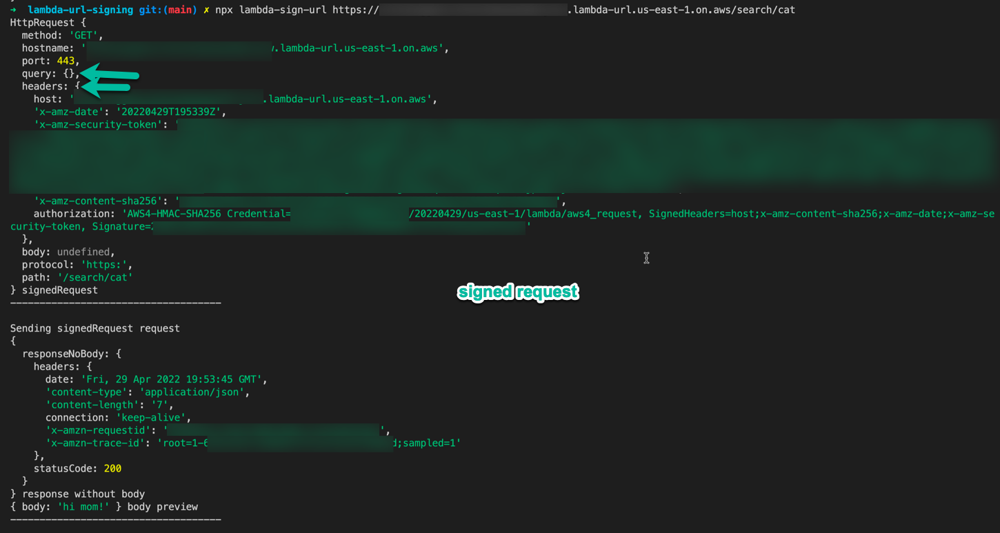

# Overview

Demonstrates how to sign an AWS Lambda Function URL request using Signature V4 and AWS-provided JavaScript / TypeScript / Node libraries, listed below, as well as a GitHub Actions-deloyed complete CDK stack that creates a CloudFront Distribution with a CloudFront Lambda @ Edge function that signs requests to the Lambda Function URL origin, passing through the Host header of the target function so the requests are not blocked, and deployable to any region using an EdgeFunction that will deploy to US-East-1.

The signing demonstration takes care of some tricky edge cases such as escaping `[]` characters in query strings, which are accepted by CloudFront, but rejected by Function URLs with a less than helpful error message.

This pattern also works to sign requests to API Gateway origins, a demonstration of which can be seen in [pwrdrvr/microapps-core](https://www.github.com/pwrdrvr/microapps-core).

## Example Deployment

- [CloudFront Distribution Endpoint - Works](https://d9ss6skvnf62k.cloudfront.net/)
- [Lambda Function URL Endpoint - Forbidden](https://gijgl6n6777vmn4twt5snlpmim0wyolq.lambda-url.us-east-2.on.aws/)

## AWS Libraries Used for Signing

- @aws-sdk/credential-provider-node
- @aws-sdk/signature-v4
- @aws-crypto/sha256-browser
- @aws-sdk/protocol-http
- @aws-sdk/node-http-handler

# Usage

```
nvm use
npm i
npm run build

# To deploy to an AWS account
npx cdk deploy

# Copy the exported Lambda URL at the end of the deployment output
# Run the tool to send both the signed (headers) and presigned (query string) requests
# The URL will look like: https://[big-random-ish-string].lambda-url.[region].on.aws/
npx aws-sign-url --service lambda|execute-api|[other] https://[your-url-value]/some/url
```

## CDK Deploy


## CLI Help


## Signed Request



## Presigned Request


